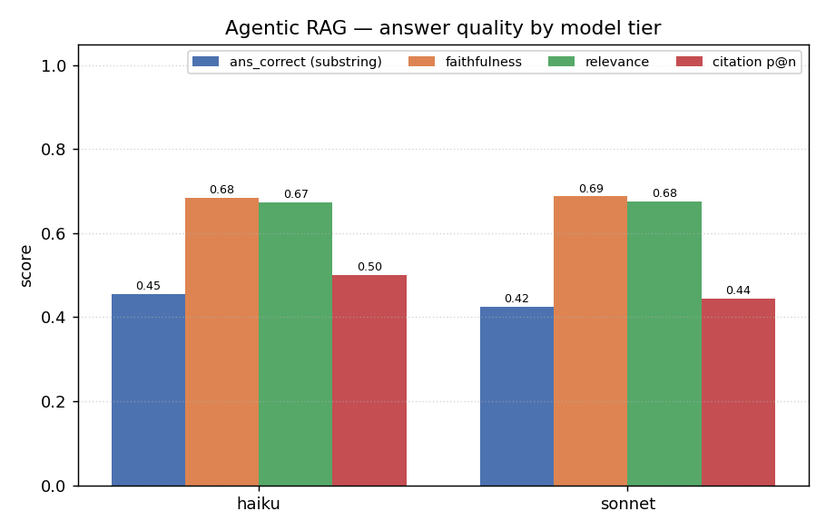
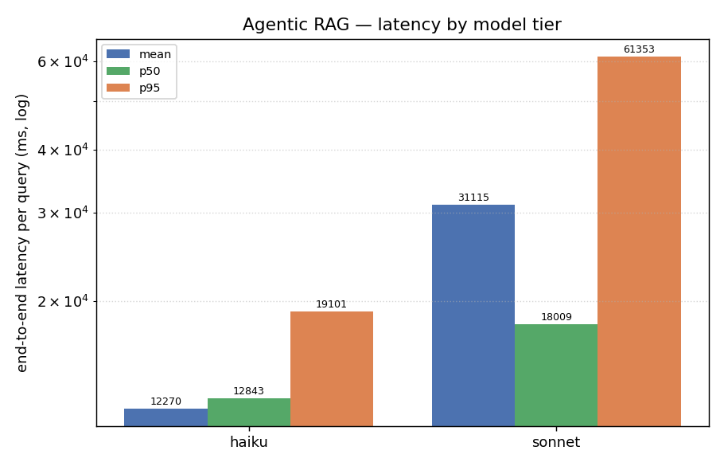

# Agentic RAG — letting a Claude Agent investigate the corpus

A second experiment, run alongside the pipeline sweep in `EXPERIMENT_REPORT.md`. Instead of
the fixed `embed → FAISS → rerank → generate` pipeline, this points a **Claude Agent** (via
the [Claude Agent SDK](https://docs.claude.com/en/api/agent-sdk)) at the `data/` folder and
lets it **investigate the corpus on its own** — grep, glob, read files, whatever it
chooses — to answer each of the 33 golden questions. The same questions, the same judge
rubric, the same metric shape, so the two approaches sit side by side.

The question this answers: **does giving the model agency over retrieval (find the passage
yourself) beat a fixed retrieval pipeline — and does a bigger model help?**

---

## Setup

| | pipeline (`EXPERIMENT_REPORT.md`) | agentic (this doc) |
|---|---|---|
| retrieval | bge-small embeddings → FAISS → cross-encoder rerank | the agent greps/reads `data/corpus/` itself |
| grounding | top-n reranked chunks injected into the prompt | whatever passages the agent chooses to read |
| generation | one Claude call over the injected chunks | the agent's final turn after investigating |
| models | one (`claude-haiku-4-5` generator) | three tiers: **haiku, sonnet, opus** |

**What is reused, so the two are comparable:**
- the grounding/answer contract — the agent's system prompt is the pipeline's
  `SYSTEM_PROMPT` verbatim (answer only from the corpus; say "I don't know" if absent; cite
  `[source: passage NNN]`), with an added "go explore the folder yourself" framing;
- `answer_correct` — case-insensitive substring of the expected answer;
- `faithfulness` + `answer_relevance` — the same LLM-judge rubric (`claude-haiku-4-5`).

**What is agentic-specific:**
- the "retrieved chunks" the judge scores against are reconstructed from the **citations the
  agent emits** (`[source: passage NNN]`) — i.e. the passages the agent says it used;
- `citation precision@n` / `citation recall@k` are computed over those cited passages
  (mapped to the golden set's `passage:N:recursive:0` id convention). Pure embedding
  metrics (`recall@k`, `MRR` over a ranked candidate list) have **no analogue** here — the
  agent does not produce a ranked list — and are left unset / shown as 0.

**Auth — the whole experiment runs on a Claude subscription, nothing on the metered API.**
Both the agent and the judge drive the `claude` CLI under the subscription OAuth login
(`claude /login`); `ANTHROPIC_API_KEY` is stripped from their environment so they never
fall back to the API. See `scripts/run_agent_experiments.py` (`_agent_env`,
`SubscriptionJudge`).

Run: `uv run python scripts/run_agent_experiments.py` (all tiers) — see the script header.

---

## Results

| tier | answer_correct | faithfulness | answer_relevance | citation p@n | latency (mean / p50 / p95) |
|---|---|---|---|---|---|
| **haiku** | 0.455 | 0.683 | 0.674 | 0.500 | 12.3 s / 12.8 s / 19.1 s |
| **sonnet** | 0.424 | 0.687 | 0.676 | 0.444 | 31.1 s / 18.0 s / 61.4 s |
| pipeline (`ablation_full`)* | 0.485 | 0.991 | 0.748 | 0.087 | 3.3 s / 2.9 s / 5.1 s |
| pipeline (`reranker_noop`)* | 0.515 | 0.991 | 0.789 | 0.106 | 2.0 s / 1.8 s / 3.2 s |

\* pipeline rows from `experiment_results.json`, for reference — same golden set, same judge.

> **Opus is missing on purpose.** Opus agent calls are hard rate-limited on the Pro
> subscription used for this run: even at concurrency 1 with 45 s spacing, the first query
> exhausted all four retries (~64 s) and returned an error. Rather than ship an all-error
> tier, opus was excluded. The runner supports it (`--models opus`) — it needs a plan with
> sustained Opus access (Max / API), not Pro. This is a quota limit, **not** a result about
> Opus's quality.

---

## What this shows

### 1. The headline: bigger model ≈ no better here. The bottleneck is investigation, not capability.

haiku and sonnet are **a statistical tie** on every quality metric — faithfulness 0.683 vs
0.687, relevance 0.674 vs 0.676, both inside the ~0.09 generation/judge noise floor
established in the pipeline report. On `answer_correct` sonnet is even nominally *lower*
(0.424 vs 0.455). Sonnet costs ~2.5× the latency (31 s vs 12 s mean; 61 s vs 19 s p95) and,
by the SDK's own estimate, ~2.8× the token spend ($2.16 vs $0.77 across the 33 queries) for
no quality gain on this corpus.

Watching the runs, sonnet clearly *recovered* several individual haiku failures (e.g.
"Which state was Coolidge born in?" — haiku cited the wrong passage 400 and scored 0;
sonnet found passage 402 and scored 1). But it introduced its own misses at about the same
rate, so the aggregate washes out. On terse, single-passage factoid questions, the limiting
factor is **whether the right passage gets found and cited**, not raw model reasoning — and
a bigger model doesn't reliably find it better.

### 2. Agentic faithfulness is bimodal — and much lower than the pipeline's.

The single sharpest finding. Per-query faithfulness is almost binary:

| | faithfulness = 1.0 | faithfulness = 0.0 | in between |
|---|---|---|---|
| haiku | 21 / 33 | 10 / 33 | 2 |
| sonnet | 20 / 33 | 9 / 33 | 4 |

The agent either cites the right passage (1.0) or **confidently answers from the wrong
one** (0.0). This is a failure mode the pipeline structurally cannot have: the pipeline's
generator can only cite chunks that retrieval actually surfaced, so its faithfulness sits at
0.99. The agent can wander to a plausible-looking but wrong passage and ground its answer
there — and both tiers do, on ~30% of queries. Examples of shared misses: "population of
Egypt?" (haiku cited 801/901, sonnet 929 — both wrong).

**Caveat on what "faithfulness" measures here:** it is scored against the agent's *own
self-reported* citations, not an independent record of what it read. If the agent reads the
right passage but cites a different one, that is counted as unfaithful — arguably a citation
honesty failure rather than a grounding failure. Either way it is a real, observable defect.

### 3. Where agentic clearly wins: citation precision.

Citation p@n is **0.50 / 0.44** for the agent vs **0.09 / 0.11** for the pipeline. The
pipeline injects 8 chunks and most are irrelevant, so precision@8 is low by construction;
the agent cites only the 1–3 passages it actually used, so its citations are far cleaner
when they are right. If the deliverable is "a short answer with a tight, auditable source
list," the agent's output is more useful — when it is faithful.

### 4. Latency: agentic is 4–15× slower.

Mean per-query latency is 12 s (haiku) / 31 s (sonnet) vs 2–3 s for the pipeline. The agent
spends multiple turns (avg ~5 for haiku, ~6 for sonnet) searching and reading before
answering; the pipeline does one retrieval + one generation. The p95 gap is starker (19 s /
61 s vs 3–5 s) — agentic latency has a long tail because some questions send the agent on a
long hunt (one sonnet query took 175 s).

---

## What this does and does not establish

**Establishes (directionally, on this corpus):**
- Model tier (haiku → sonnet) does **not** move agentic answer quality here — both inside
  the noise floor, sonnet not better on any metric, and materially slower + costlier.
- Agentic retrieval has a **distinct failure mode** (cite-the-wrong-passage) that depresses
  faithfulness to ~0.68 vs the pipeline's ~0.99, on ~30% of queries.
- Agentic citations are **much more precise** (0.5 vs 0.09) and the approach is **much
  slower** (4–15×). These come from latency + citation set sizes and are the most
  reproducible numbers here.

**Does NOT establish:**
- Any `answer_correct` / `faithfulness` / `relevance` *difference* as significant — every
  tier is a **single run of 33 questions**, and all the cross-tier gaps are inside the
  ~0.09 noise floor. Treat haiku-vs-sonnet quality deltas as "indistinguishable," not as
  "haiku wins."
- That agentic RAG is worse *in general*. This corpus is the worst case for it: short,
  self-contained passages where a bi-encoder already nails retrieval (pipeline recall@5
  ≈ 0.74), so the agent's freedom to investigate buys little and its freedom to mis-cite
  costs a lot. On a corpus needing multi-hop synthesis, cross-document reasoning, or
  structure the embedder can't capture, the trade could invert — untested here.
- Anything about **opus** — excluded due to Pro rate limits (see above).
- The cost numbers are the **SDK's token estimates**, not subscription charges; on a sub
  these draw against plan usage, not a per-token bill. Use them as a relative signal
  (sonnet ≈ 2.8× haiku), not an invoice.

**To strengthen this:** run each tier N times and report variance; get sustained Opus
access and add the third tier; log the files the agent actually *reads* (not just what it
cites) to separate "read wrong passage" from "cited wrong passage"; add a multi-hop /
cross-document question subset where investigation should actually pay off.

---

_Generated from `scripts/run_agent_experiments.py` (runner) + `scripts/plot_agent_experiments.py`
(figures). Agent and judge both run on the Claude subscription via the Agent SDK — no API
key. haiku + sonnet completed all 33 queries with zero errored rows; opus was excluded due
to Pro-tier Opus rate limits. Numbers from LLM-backed stages are not bit-reproducible;
expect generation/judge metrics to vary by up to the ~0.09 noise floor on re-runs._
