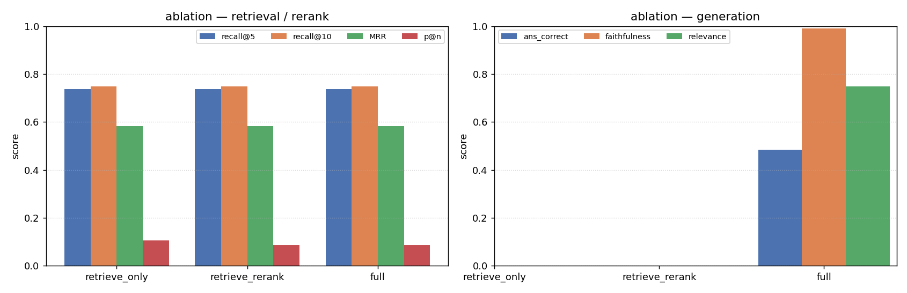
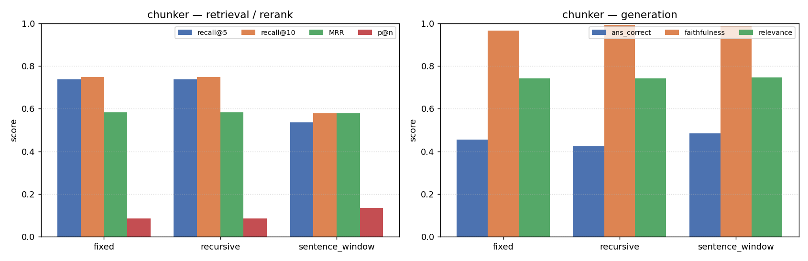
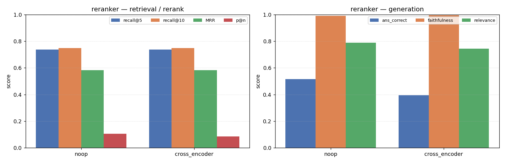
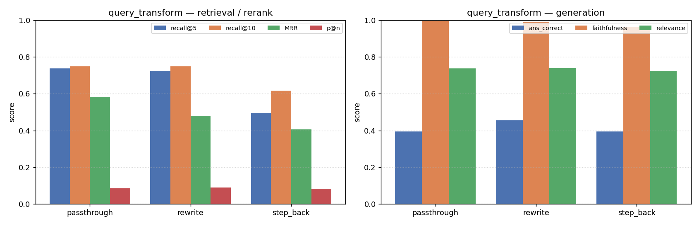

# RAG technique comparison — what each stage actually buys

This report uses the harness's whole reason for existing (ARCHITECTURE.md §5): change one
stage in `config.yaml`, re-run, read the per-stage delta. It compares the techniques
available today across four experiment families — an **ablation ladder**, a **chunker**
sweep, a **reranker** sweep, and a **query-transform** sweep — scoring every stage
separately.

**The headline, stated carefully:** on this corpus, the two techniques the architecture doc
expected to help most — the cross-encoder reranker and query transforms — **add latency
without buying measurable quality.** The reranker leaves retrieval ranking untouched (it
re-orders an identical candidate set) and nudges precision@n down within the noise; the LLM
query transforms actively *degrade* retrieval ranking (MRR and recall drop). The harness is
doing its job: it tells you what actually moved the numbers here, not what should in general.
We are deliberate below about which findings are **established** (deterministic,
reproducible) versus **directional** (generation-judge metrics inside the measured noise) —
see §5.

## How to read this (and what NOT to over-read)

- **Corpus + golden set:** `rag-mini-wikipedia`, 3,200 short single-fact passages. Golden
  set = **33 hand-verified queries** (29 single-passage, 4 multi-passage). This is small.
  Treat every number as directional, not decisive.
- **The generation noise floor is large — and it is a floor, not a bound.** Four variants in
  this sweep run an **identical *query-time* pipeline** (cross-encoder rerank → passthrough
  → Haiku generation + judge): `ablation_full`, `chunker_recursive`, `reranker_cross_encoder`,
  and `qt_passthrough`. (Their *ingests* differ — `chunker_recursive` re-chunks/re-embeds —
  but all three reuse-ingest variants share one index and `chunker_recursive` re-derives the
  same recursive chunks, so the generator sees the same top-8 in practice.) Their
  `answer_correct` scores are **{0.485, 0.424, 0.394, 0.394} — a 0.091 spread that is almost
  entirely generation + judge non-determinism**. Critically, **0.091 is the observed range
  of four points, not a statistical confidence bound** — the true run-to-run sd is unknown
  (single run each), so the real floor is *at least* this wide. So:
  > **Treat any `answer_correct` delta on the order of ~0.09 or less as noise, not a
  > technique effect.** A delta only modestly above it (e.g. −0.12) is suggestive, not
  > established — it needs repeated runs with reported variance to confirm.
- **`precision@n` has its own granularity floor.** At n=8 over N=33 queries, one
  relevant-chunk flip is ≈ `1/(8·33)` ≈ **0.004**, and most golden rows have a single
  expected chunk, so realistic p@n moves are coarse. A p@n difference of ~0.02 (e.g. the
  reranker's 0.106 → 0.087) is **under two chunks' worth across the whole set** — directional
  at best, not a clean effect.
- **`answer_correct` is a brittle substring check** (`expected_answer.lower() in
  answer.lower()`), so it under-counts correct paraphrases. `faithfulness` and
  `answer_relevance` (LLM-judge) are the better generation signals — but they are *also*
  single-run and noisy; only the retrieval/rerank metrics are deterministic.
- **`recall@k` (k=50) is high but not flat.** It sits at 0.848 for the seven variants that
  share the base index (over-retrieving 50 of ~3,200 chunks usually catches the gold one),
  but it **drops where the candidate pool changes** — sentence_window 0.721, qt_rewrite
  0.788, qt_step_back 0.778. So recall@50 is a *weak* discriminator, not a useless one; it
  still flags the techniques that move the candidate set. **`recall@5` and `MRR` remain the
  sharper retrieval signals.**
- **Latency** is per-query wall-clock in ms, steady-state (cold model loads warmed off
  first). The **latency chart is two panels** (`figures/latency.png`): a *linear, stacked
  per-stage* panel (transform/retrieve/rerank/generate **means**, which sum to the
  end-to-end time) that shows *where* the cost goes, and a *log* panel of *end-to-end
  p50/p95* for cross-variant visibility. The same per-stage means are tabled in
  `experiment_tables.md` under "per-stage latency". **Note two different statistics are in
  play:** per-stage costs are reported as *means*; the end-to-end "p50/p95" and the
  "~940 ms"-style deltas in the prose are *percentiles*. They are close here (~0.9 s rerank
  either way) but not identical — means are cold-load-sensitive, percentiles less so.
- **Reproducibility:** retrieval/rerank metrics are deterministic and will reproduce exactly;
  generation, judge, and the LLM query transforms vary run-to-run. **Each variant is a single
  run** — no variance is reported, which is the report's main statistical limitation.

Full machine-readable numbers: `docs/experiment_results.json`. Auto-generated tables
(including the per-stage latency breakdown): `docs/experiment_tables.md`. These are tracked
copies of the runner's outputs under the gitignored `vectorstore/experiments/`. Regenerate
with `uv run python scripts/run_experiments.py` then `uv run python scripts/plot_experiments.py`.

---

## 1. Ablation ladder — what each query-time stage adds

Hold ingest fixed (recursive chunk, bge-small embed, FAISS flat); add one query-time stage
at a time.

_(Quality metrics only; the latency cost of each stage is in `figures/latency.png` and the
per-stage table in `experiment_tables.md`.)_

| rung | recall@5 | MRR | p@n | ans_correct | faith | relevance | lat p50/p95 (ms) |
|---|---|---|---|---|---|---|---|
| retrieve only | 0.737 | 0.583 | 0.106 | — | — | — | **6 / 20** |
| + rerank | 0.737 | 0.583 | 0.087 | — | — | — | 865 / 1193 |
| + generate (full) | 0.737 | 0.583 | 0.087 | 0.485 | 0.991 | 0.748 | 2906 / 5081 |

(`ans_correct`/`faith`/`relevance` are "—" for the first two rungs because `--no-generate`
ran no generation — there is no answer to score, *not* a score of zero.)

**Reading.**
- **Retrieval already does the heavy lifting.** recall@5 = 0.74, MRR = 0.58 with nothing but
  dense search. The gold chunk is usually found and usually ranked high.
- **Reranking nudged precision@n down** (0.106 → 0.087) — about half a relevant-chunk per
  the whole set, so directional, not decisive (see §3 and the p@n granularity floor above).
  Either way it is not a win here.
- **Generation is the expensive, valuable rung:** faithfulness 0.99, relevance 0.75 — the
  grounding prompt works. But it dominates latency: ~6 ms retrieve-only → ~2.9 s p50, i.e.
  roughly **two orders of magnitude** (a single-run ratio; treat the exact multiple loosely).

> The ablation's real lesson here: **the cost is almost entirely rerank + generate, and on
> this corpus rerank buys nothing measurable on any metric.** A retrieve-only + generate
> pipeline would be ~0.9 s faster per query (the rerank stage) at no *measured* quality loss.
> Latency magnitudes: read the **linear** panel of `figures/latency.png` (the log panel
> flattens this staircase) and the per-stage table in `experiment_tables.md`.

---

## 2. Chunker sweep — recursive vs fixed vs sentence-window

One-factor-at-a-time over the three chunkers. Each variant **re-chunks, re-embeds,
re-indexes, and re-derives its own golden set** (chunk IDs embed the chunker name, so the
ground truth must be regenerated per chunker — otherwise retrieval scores garbage).

| chunker | recall@5 | recall@10 | MRR | p@n | ans_correct | faith | relevance |
|---|---|---|---|---|---|---|---|
| fixed | 0.737 | 0.747 | 0.582 | 0.087 | 0.455 | 0.965 | 0.742 |
| recursive | 0.737 | 0.747 | 0.583 | 0.087 | 0.424 | 0.992 | 0.742 |
| sentence_window | **0.536** | **0.579** | 0.579 | **0.136** | 0.485 | 0.988 | 0.747 |

**Reading.**
- **fixed ≈ recursive on retrieval.** Identical recall@5/@10, MRR within 0.001. On a corpus
  of short, already-clean passages, structure-aware splitting has nothing to exploit — the
  recursive chunker's advantage shows up on long, headed documents, which this corpus lacks.
  The `ans_correct` gap (0.455 vs 0.424, Δ 0.031) is **well inside the ~0.09 noise floor →
  not a real difference**, and is single-run anyway.
- **sentence_window makes a genuine trade.** recall@5 drops hard (0.74 → 0.54) and even
  recall@50 falls (0.85 → 0.72) — smaller units mean the gold sentence-window is more often
  outside the top-k — but precision@n *rises* (0.087 → 0.136), because the windows that do
  surface are tighter. This is the textbook small-retrieval-unit trade-off, and it is the one
  real, above-noise retrieval effect in the chunker family. Note this variant indexes **4,519
  chunks vs ~3,222** for fixed/recursive — it splits the same corpus into more, smaller
  units, which is *why* the gold unit is harder to land in the top-k.

> **No chunker is a free win here.** recursive is a safe default; sentence_window is only
> worth it if you add parent-document expansion (retrieve the precise window, feed the
> larger parent) — which this slice does not yet implement.

---

## 3. Reranker sweep — the counterintuitive result

noop vs cross-encoder, holding retrieval and generation identical (reuses one shared index).
The architecture doc calls the cross-encoder "usually the biggest quality jump per line of
code." **Here it does not help — and the deterministic metrics say it slightly hurts.**

_(Quality metrics only — the reranker's ~940 ms cost is in the latency figure/table, not
here.)_

| reranker | recall@5 | MRR | p@n | ans_correct | faith | relevance | lat p50/p95 (ms) |
|---|---|---|---|---|---|---|---|
| noop | 0.737 | 0.583 | 0.106 | 0.515 | 0.991 | 0.789 | **1779 / 3238** |
| cross_encoder | 0.737 | 0.583 | 0.087 | 0.394 | 0.995 | 0.744 | 2720 / 3759 |

**Reading — with the noise made explicit.**
- Retrieval is identical by construction (same candidates), so recall/MRR don't move. The
  **deterministic** effects are: precision@n down (0.106 → 0.087, ~half a chunk over the set)
  and **~940 ms added latency**. The latency cost is real and reproducible; the p@n move is
  directional (within the p@n granularity floor).
- The **generation** deltas are *not* established. noop's `ans_correct` 0.515 is the single
  **highest** generation score anywhere in the sweep, and the cross-encoder's own
  `ans_correct` ranges **0.394–0.485 across its three identical-pipeline appearances**
  (`reranker_cross_encoder` 0.394, `qt_passthrough` 0.394, `ablation_full` 0.485). So the
  "−0.121 drop" is largely **noop catching a high draw and cross-encoder a low one** from
  overlapping noisy distributions — not a clean regression. relevance (0.789 → 0.744) is one
  single run each and similarly inside the noise. Confirming a real generation effect would
  need repeated runs with reported variance.
- **Why would a reranker hurt?** On short single-fact passages the bi-encoder already ranks
  the gold chunk near the top; the cross-encoder re-scores the top-50 on `(query, passage)`
  surface relevance and sometimes promotes a topically-similar-but-wrong passage above the
  gold one, pushing the answer out of the top-8 the generator sees. The reranker is built
  for noisy, long-tail candidate sets; it has little to fix and some room to break here.

> **On this corpus, the cross-encoder reranker costs ~940 ms and buys no measurable
> quality** (precision@n drifts down; generation deltas are inside the noise). That is a
> corpus-specific result, not a universal one — but "a reranker that does not earn its
> latency here" is exactly the kind of finding the harness exists to surface, and it would
> have been invisible without per-stage scoring.

---

## 4. Query-transform sweep — LLM rewriting before retrieval

passthrough (baseline) vs an LLM `rewrite` (expand entities/synonyms) vs `step_back`
(generalize the question). The transform rewrites the *retrieval* query only; the generator
still answers the original question.

_(Quality metrics only — the ~1.3 s the transform LLM call adds is the bottom slice of each
bar in the latency figure's stacked panel.)_

| transform | recall@5 | recall@10 | MRR | ans_correct | faith | relevance | lat p50/p95 (ms) |
|---|---|---|---|---|---|---|---|
| passthrough | 0.737 | 0.747 | 0.583 | 0.394 | 0.995 | 0.738 | 2840 / 6035 |
| rewrite † | 0.722 | 0.747 | 0.481 | 0.455 | 0.989 | 0.739 | 4259 / 5603 |
| step_back | **0.495** | 0.616 | **0.405** | 0.394 | 0.964 | 0.723 | **4525 / 5921** |

† `rewrite` was executed in a **separate re-run** from the other 10 variants (its first run
hit a judge JSON-parsing bug, now fixed). Given the run-to-run generation noise, its
generation numbers are even less directly comparable to the others than the within-sweep
variants are.

**Reading.**
- **Both transforms hurt retrieval ranking — this is the deterministic, established part.**
  rewrite drops MRR 0.583 → 0.481; step_back drops it harder (→ 0.405) and craters recall@5
  (0.74 → 0.50). These are reproducible (retrieval is deterministic given the rewritten
  query — though the *rewrite itself* is an LLM call and will vary). Rewriting a short factual
  question ("Which county was Lincoln born in?") into a broader or synonym-expanded query
  moves the *query* embedding away from the terse passage that answers it — the opposite of
  the asymmetry these techniques fix on verbose/conversational queries.
- **Generation does not move outside the noise** (rewrite's ans +0.061, step_back's ans
  ±0.000 — both ≤ the ~0.09 floor). relevance/faithfulness are flat-to-slightly-down, single
  run each. No generation conclusion is established here.
- **They add ~1.3 s of latency** (the per-query rewrite LLM call: `transform_ms` ≈ 1411 ms
  for rewrite, 1276 ms for step_back — see the per-stage latency table) for no upside here.

> **Query transforms are a net loss on terse factoid queries.** They earn their cost on
> long, conversational, or multi-hop questions — which this golden set deliberately does not
> contain. The result is "no benefit *for this query distribution*," not "no benefit ever."

---

## 5. What this sweep does and does not establish

**Establishes — deterministic + reproducible (on this corpus):** these come from
retrieval/rerank metrics and latency, which reproduce exactly run-to-run.
- Dense retrieval alone is strong (recall@5 ≈ 0.74, MRR ≈ 0.58). recall@50 is high (0.85 on
  the base index) but **not saturated** — it drops to 0.72–0.79 for sentence_window and the
  two transforms, i.e. it still registers techniques that change the candidate pool.
- sentence_window trades retrieval recall for rerank precision (recall@5 0.74 → 0.54, p@n
  0.087 → 0.136) — the one clearly above-floor retrieval effect in the sweep.
- Both LLM query transforms degrade retrieval *ranking* on terse factoid queries (MRR 0.583
  → 0.481 rewrite, → 0.405 step_back; recall@50 also drops, 0.848 → 0.79/0.78). One caveat:
  the *direction* is robust and large, but the exact value is a **single LLM rewrite draw** —
  retrieval is deterministic only *given* the rewritten query, and the rewrite itself varies
  run-to-run. Read these as "transforms clearly hurt ranking here," not as bit-exact numbers.
- The cross-encoder reranker adds ~940 ms and does not improve any metric here (precision@n
  drifts down). **Cost established; "improves nothing" established; "actively harms quality"
  is *not* — see below.**
- Latency cost structure: rerank ≈ 0.9 s, generation ≈ 2 s, each LLM query transform ≈ 1.3 s
  (per-stage table in `experiment_tables.md`).

**Directional only — single run, inside the generation/judge noise (do NOT treat as
established):**
- Every `answer_correct` and `answer_relevance` *difference* between variants. The measured
  floor is ~0.09 (range of 4 identical-pipeline runs) and is a floor, not a bound. This
  includes the reranker's −0.121 ans_correct (suggestive, unconfirmed), all chunker
  generation gaps, and all transform generation gaps.

**Does NOT establish at all:**
- That any of these techniques is bad *in general*. Every negative result is plausibly a
  corpus/query-distribution artifact (short passages, terse single-hop questions, N=33).
- Multi-hop / parent-document behavior — the golden set is 88% single-passage by design, so
  parent-document expansion and decomposition transforms have nothing to bite on.
- Any generation effect without variance: **every variant is a single run.**

**To make the conclusions stronger** (future work, each gated behind "did eval improve?"):
grow the golden set well past 33 and add multi-hop questions; run each judged variant N
times and report variance, not a single number; add a verbose/conversational query subset
where transforms are expected to help; implement parent-document expansion to pair with
sentence_window.

---

_Generated from `scripts/run_experiments.py` (sweep) + `scripts/plot_experiments.py`
(figures). One variant (`qt_rewrite`) initially failed on a judge JSON-parsing bug that was
fixed and re-run; all 11 variants are present. Numbers from LLM-backed stages are not
bit-reproducible; expect generation metrics to vary by up to the ~0.09 noise floor on
re-runs._
